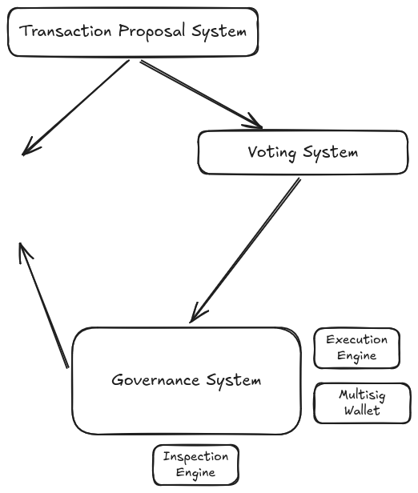

# ARES Protocol Architecture

The ARES Protocol is a highly secure, modular treasury execution protocol engineered to manage a massive $500M+ autonomous treasury. The architecture is deliberately fragmented into robust independent modules to minimize attack surfaces and provide granular control over the proposal lifecycle, execution queue, and reward distribution.

## Core Architecture Components

The implementation closely follows the conceptual architecture of the ARES Protocol, mapping out the independent systems to our optimized Solidity smart contracts.

### 1. Transaction Proposal System (`Proposer.sol`)
The entryway for system governance. Instead of executing actions immediately, it rigorously enforces a complete "commit phase" and voting lifecycle.
- **Role**: Allows users to submit proposals containing ABI-encoded payloads. It assigns deterministic hashes to proposals, saving state costs by keeping raw call data off-chain.
- **Interfaces**: Connects downstream to the Voting System.

### 2. Voting System (`Proposer.sol` & `IVotes` Token)
Integrated seamlessly alongside the Proposal System for gas efficiency, this subsystem handles the consensus mechanism.
- **Role**: Voters cast weights during the `VOTING_PERIOD`. It uses past token snapshots (`getPastVotes`) to prevent flash-loan manipulation.
- **Interfaces**: Connects downstream to the Governance System.

### 3. Governance System (`Proposer.sol`)
The state machine managing the lifecycle of proposals (Pending -> Active -> Queued -> Executed/Cancelled).
- **Role**: Once quorum and majority are reached, it acts as the sole authorized entity capable of passing approved payloads to the Execution Engine.
- **Interfaces**: Connects downstream to the Execution Engine.

### 4. Execution Engine (`Queue.sol`)
The time-delayed engine executing payloads conditionally upon ETA maturity.
- **Role**: A custom-built FIFO structure ensuring precise execution order of approved payloads. It wraps an internal OpenZeppelin `TimelockController` ensuring an impenetrable FIFO guarantee.
- **Interfaces**: Connects downstream to the Multisig Wallet (Treasury) to execute final calls.

### 5. Multisig Wallet / Treasury (`ARESTreasury.sol`)
The central vault holding protocol funds ($500M+). 
- **Role**: This isolated vault acts autonomously based on queued instructions. It solely accepts and executes payloads passed directly from the Execution Engine.
- **Interfaces**: Represents the final destination of the call tree.

### 6. Inspection Engine (`Authorizer.sol` & `ARESTreasury.sol`)
The security and verification layer operating globally to validate incoming interactions and outgoing executions.
- **Role**: 
  - **Inbound Inspection (`Authorizer.sol`)**: Validates EIP-712 structured signatures for off-chain approvals (gasless proposals), checking for nonces, chain IDs, and `s`-value malleability.
  - **Outbound Inspection (`ARESTreasury.sol`)**: Inspects proposed executions against a strict daily rate limit (`5% MAX_DAILY_WITHDRAWAL_BPS`), preventing large treasury drains even if malicious payloads pass governance.

### 7. Contributor Reward Distribution (`Distributor.sol`)
A highly optimized supplementary module using Merkle Trees to distribute airdrops and contributor rewards at scale without bloating contract state. Only the Execution Engine can update the authoritative `merkleRoot`.

## System Workflow Diagram
1. **Transaction Proposal System**: User calls `Proposer.propose()` (or `proposeBySig()`).
2. **Voting System**: After a mandatory `VOTING_DELAY`, voters cast snapshot weights.
3. **Governance System**: If passed, `Proposer.queue()` transitions the state and forwards the payload.
4. **Execution Engine**: The `Queue` schedules the payload strictly after its predecessors.
5. **Multisig Wallet**: Post-ETA, `Proposer.execute()` forces the `Queue` to initiate the final call tree through the isolated `ARESTreasury`.
